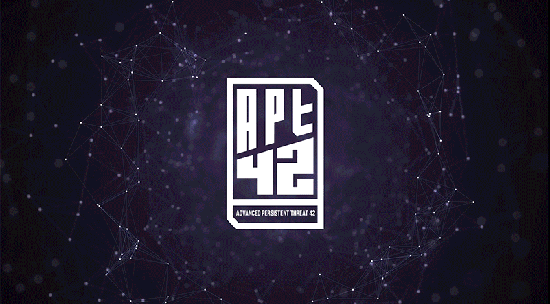

  

<h1 align="center">
  Resources for 42 students
</h1>
<h3 align="center">
  Share resources, assets and information :robot:
</h3>

In this repository, you will find various resources, tutorials, FAQs and so forth to improve your infosec skills.

### Table of Contents

- [List of resources](#list-of-resources)
- [Security-related projects at 42](#security-related-projects-at-42)
- [Culture](#culture)
- [How to contribute](#how-to-contribute)

## List of resources

### Online courses and training

- [Try Hack Me](https://tryhackme.com/): Guided challenges - good starting point
- [HTB Academy](https://academy.hackthebox.eu/): Online courses focus on penetration testing and bug hunting. Good starting point.
- [Open Classrooms x root-me](https://blog.openclassrooms.com/2022/08/24/cybersecurite-offensive-sexercer-avec-root-me-et-openclassrooms/): Online courses - good starting point
- [Cryptohack](https://cryptohack.org/) : from beginner to advanced crypto exercices and courses.
- [Cryptopals](https://cryptopals.com/): crypto exercises
- [INE](https://my.ine.com/): Tutorials - good starting point
- [root-me](https://www.root-me.org/): CTFish challenges - CTF training
- [NewbieContest](https://www.newbiecontest.org/): CTFish challenges - CTF training
- [HackThisSite](https://www.hackthissite.org/): CTFish challenges - CTF training
- [Google CTF](https://capturetheflag.withgoogle.com/): CTFish challenges - CTF training for beginners by google (2021 edition).
- [h4ck1ng g00gle](https://h4ck1ng.google/): CTFish challenges - CTF training for beginners (2022 edition).
- [HackTheBox](https://www.hackthebox.eu/): Challenges and boxes (training environments) - requires a few basis but available starting points for new students.
- [PortSwigger - Web Security Academy](https://portswigger.net/web-security): Web security training
- [microcorruption](https://microcorruption.com/login): Embedded Security

### Reverse engineering

- [Malware Unicorn](https://malwareunicorn.org/): Resources and workshops by Amanda Rousseau (Offensive Security Engineer, Red Team at Facebook)
- [vx-underground](https://vx-underground.org/)
- [Pwn.college](https://pwn.college/): Very diverse courses on many aspects of binary exploitation.
- [beginners.re](https://beginners.re/): A free pdf book on reverse engineering for beginners. Really complete.

### Container security

- [Docker Security Cheat Sheet](https://cheatsheetseries.owasp.org/cheatsheets/Docker_Security_Cheat_Sheet.html)
- [kubernetes-goat](https://github.com/madhuakula/kubernetes-goat): an intentionally vulnerable cluster environment to learn and practice Kubernetes security
- [peirates](https://github.com/inguardians/peirates): Kubernetes Penetration Testing tool
- [gke-auditor](https://github.com/google/gke-auditor): tool to detect a set of common Google Kubernetes Engine misconfigurations

### OSINT

Some CTF still available to train:

- [Cybersoc | Cyber Detective CTF](https://ctf.cybersoc.wales/): entry-level OSINT CTF
- [Cybersoc | Cyber Investigator CTF](https://investigator.cybersoc.wales/): the sequel to Cyber Detective CTF
- [CYBAR OSINT CTF 2020](https://github.com/cybar-party/cybar-osint-ctf-2020): entry-level OSINT CTF that can be run locally - less easy than Cybersoc

### Privacy

- :fr: [Guide de protection numérique, nothing2hide](https://nothing2hide.org/fr/guide-de-protection-numerique/): beginner-friendly
- [Tech4Press](https://tech4press.org/en/): free digital emergency assistance service dedicated to journalists and activists
- :fr: [Guides de l'association Echap](https://echap.eu.org/ressources/)
- :fr: [La Quadrature du net](https://www.laquadrature.net/): Analyses juridiques

### Tools

- [CTFNote](https://github.com/TFNS/CTFNote): collaborative tool for CTF teams

### Machine Learning and infosec

You can check [this list](ml_for_infosec.md).

### Books

- *Serious Cryptography*, Jean-Philippe Aumasson

### Career

- [Career Cheatsheet](https://trailofbits.github.io/ctf/intro/careers.html)

## Security-related projects at 42

You can check [this list](projects_at_42.md)

## Culture

### Movies

- [Movies For Hackers](https://github.com/k4m4/movies-for-hackers)

### Books

- :fr: *La face cachée d'internet* de Rayna Stamboliyska
- :fr: *Comme un empire dans un empire* d'Alice Zeniter
- *Hacker, Hoaxer, Whistleblower, Spy: the Story of Anonymous*, Gabriella Coleman

### Games

- [sourcing.games](https://sourcing.games/): Games for recruiters and sourcers.
- [GeoGuessr](https://www.geoguessr.com/): GeoGuessr is a geography game which takes you on a journey around the world and challenges your ability to recognize your surroundings.
- [Simulacra](https://store.steampowered.com/app/712730/SIMULACRA/): An interactive horror experience of exploring a missing woman’s phone.
- [Yolo Space Hacker](https://store.steampowered.com/app/1341450/Yolo_Space_Hacker/): Welcome to our ethical hacker's organisation: we will teach you how to use actual hacker tools (terminal, proxy, reverse shells...) to scan the network, crack passwords, bypass server security and solve the mystery of the Bikini-72 space station.

### Podcasts

- :fr: [NoLimitSecu](https://www.nolimitsecu.fr/): Podcast sur la cybersécurité.
- :fr: [No Log](https://shows.acast.com/no-log): Décryptage, rencontres, chroniques, récits...
- [Darknet Diaries](https://darknetdiaries.com/): True stories from the dark side of the Internet

## How to contribute

You are a 42 student and willing to contribute? Follow these [guidelines](CONTRIBUTING.md).
